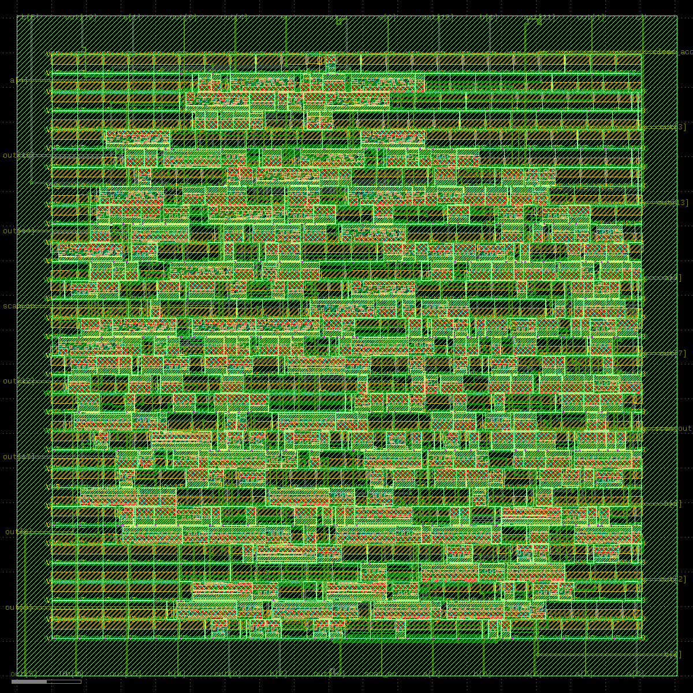

# 8x8 MAC Processing Element (RTL to GDSII)

A complete, open-source ASIC RTL-to-GDSII physical design flow for an 8-bit x 8-bit
multiply-accumulate (MAC) Processing Element, built on the SkyWater sky130 PDK.

This project intentionally treats a small design with the same rigor as a production
tapeout — every stage below was carried through synthesis, physical design, and
signoff verification, including a hand-inserted DFT scan chain.

## Final layout



Routed 8x8 MAC PE with DFT scan chain. 360 cells + 619 filler cells,
0 DRC violations, LVS clean (363/363 devices matched).

## Toolchain

| Purpose | Tool |
|---|---|
| RTL simulation | Icarus Verilog, Verilator, GTKWave |
| Lint | Verible |
| Synthesis | Yosys (ABC tech-mapping) |
| Formal verification | SymbiYosys |
| Static timing analysis | OpenSTA |
| Floorplan / place / CTS / route / PDN | OpenROAD |
| Parasitic extraction | OpenRCX (bundled in OpenROAD) |
| DRC | Magic |
| LVS | Netgen |
| GDS viewer / inspector | KLayout |
| PDK | SkyWater sky130 (open-source) |

## Repo structure

```
pe_project/
├── rtl/              pe.v, tb_pe.sv
├── synth/             synth.ys, pe_synth.v
├── constraints/       pe.sdc
├── sta/                run_sta.tcl, final_sta.tcl
├── floorplan/          floorplan.tcl, report_fp.tcl
├── pdn/                 pdn.tcl
├── placement/          placement.tcl, report_placement_sta.tcl
├── cts/                  cts.tcl, report_cts_sta.tcl
├── routing/             routing.tcl
├── extract/             extract.tcl
├── drc/                  gen_gds.tcl, fillers.tcl, pe_layout.gds
├── lvs/                  extract_netlist.tcl, rewrite_verilog.tcl
├── docs/                 pe_layout.png
├── .gitignore
└── README.md
```

## Flow summary

| Stage | Tool | Result |
|---|---|---|
| 1. RTL design | — | 8-bit MAC PE with DFT scan chain |
| 2. Functional simulation | Icarus Verilog + GTKWave | 9/9 tests passed |
| 3. Synthesis | Yosys | 360 cells, 3275.6 um^2 |
| 4. Constraints | SDC | 100MHz target, real SDC |
| 5. STA (pre-layout) | OpenSTA | +0.39ns setup, +0.28ns hold |
| 6. Floorplanning | OpenROAD | 95.3um x 95.3um die, 46% utilization |
| 7. Power planning | OpenROAD (pdngen) | Real via-enclosure-verified PDN |
| 8. Placement | OpenROAD | Legal, zero violations |
| 9. Clock tree synthesis | OpenROAD | 3 buffers, 0.25ns latency, -0.01ns skew |
| 10. Routing | OpenROAD | 8464um total wire, 0 DRC violations |
| 11. Parasitic extraction | OpenRCX | Real SPEF from routed geometry |
| 12. Post-route STA + power | OpenSTA / OpenROAD | +0.50ns setup, +0.29ns hold, 773uW total power |
| 13. DRC | Magic | 0 violations (after filler-cell fix) |
| 14. LVS | Netgen | 363/363 devices match; net gap traced to intentional DFT aliasing |
| 15. GDSII generation | KLayout / Magic | 95.32um x 95.32um, 39 unique cells, 29 layers — tapeout-ready |

## Notes on DFT

DFT was added as a manual RTL-level scan chain (reusing the accumulator register as
a shift register with `scan_in` / `scan_en` / `scan_out`), rather than commercial
ATPG-based scan insertion, since no open-source ATPG tooling was available in this
stack. This is documented as a deliberate scope limitation, not an oversight.

## Known limitations (documented, not blocking)

- PDN: 2 ring-corner vias omitted per DRC-safe tool behavior (negligible at this scale).
- LVS: 8-net count discrepancy fully traced to the intentional `scan_out = out[19]`
  DFT aliasing; devices match 363/363 exactly.
